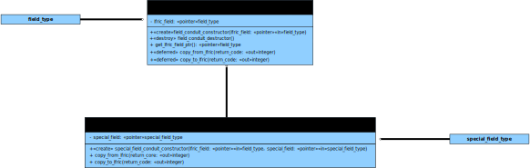

Introducing External Field
==========================

The LFRic infrastructure provides field objects which hold field data in a form
useful to the infrastucture. Other models, libraries and tooling will hold
field data in a form useful to their needs. Sometimes it is necessary to
transfer data between these different islands of incompatability.

The mechanism on offer to handle these occasions is the "External field."

Design
~~~~~~

The infrastructure goes to some lengths to protect the raw field data from
interference. This provides a lot of value in the form of reliability and
maintainability.

Transforming field data for an external user must, by definition, compromise
that protection. The concept of external fields exists to minimise the scope of
that vulnerability.

Each external field is, in fact, a mapping between an LFRic field and a
non-LFRic field. It contains any encapsulation breakage within itself, thus
preventing the guts of fields from being exposed.

    Class diagram showing an external field linking an LFRic field with
    another type of field.

Although the class diagram above shows a mapping between two field classes
there is no reason why the external field need be an actual object. In the
case of coupling through OASIS the external "field" is, in fact, calls to the
transmit and receive functions of OASIS.

Implementation
~~~~~~~~~~~~~~

Developing a new external field should not be too hard. The most complicated
part is working out how the external field data is presented.

Start by deriving a new class from the abstract external field class.

The constructor of this new class should take an LFRic field pointer and a
pointer to the field class you want to support. (This may be a primitive type
array.) Nothing is done with these pointers beyond salting them away for
future use.

The two deferred methods then need to be implemented. This is where the work
happens. They both use the field proxy object to gain access to the field's
contents and either populate the external field with that content or update
the content from the external field.

